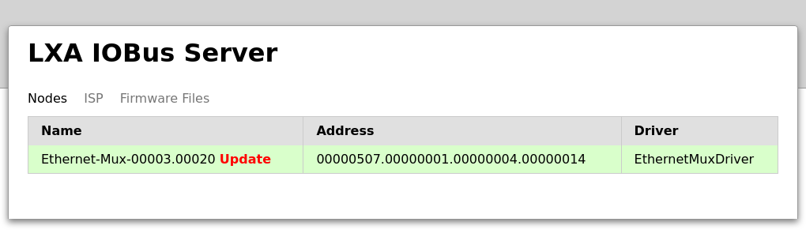
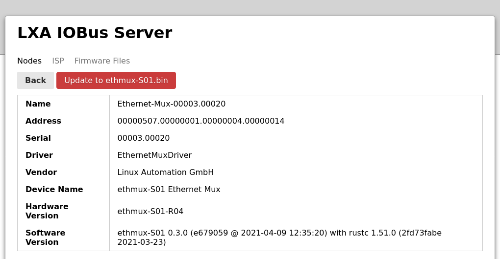
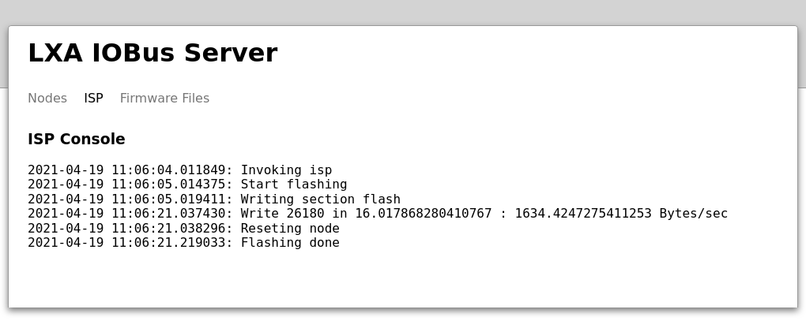
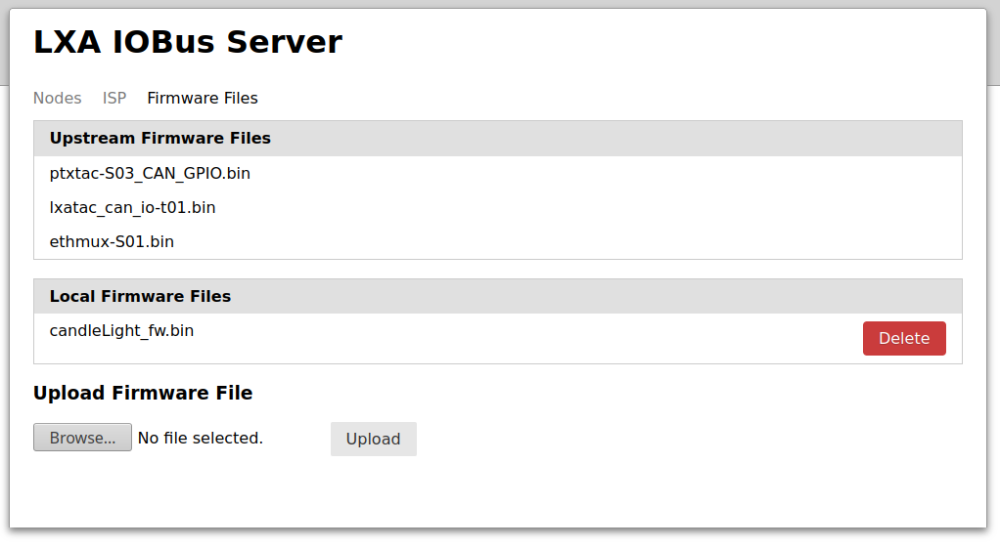
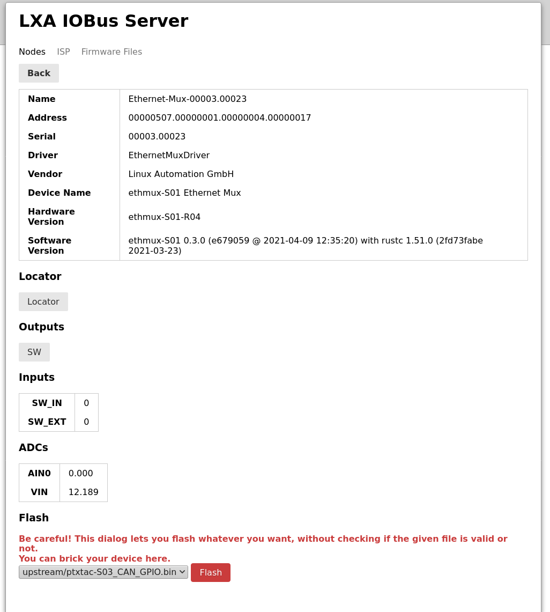

Software and Firmware Upgrades
==============================

Upgrading the lxa-iobus-server
------------------------------

Upgrading the LXA iobus-server is done by installing a new
version of the Python package.

Before installing a new version of the server stop
the currently running lxa-iobus-server.
If you are using the provided systemd-service run:

::

   $ sudo systemctl stop lxa-iobus.service

Afterwards you can build a new ``env``:

::

   $ cd /path/to/the/lxa-iobus/repository
   $ git pull
   $ make clean
   $ make env

Now you can start your service again:

::

   $ sudo systemctl start lxa-iobus.service

Bundled Firmware Upgrades
-------------------------

.. _firmware-upgrade:

The ``lxa-iobus-server`` software comes bundled with the latest firmware binaries
for the IOBus devices.
The availability of new firmware upgrades for devices
is indicated in the Web-Interface by a red **Update** text in the node list:

   List of nodes. Devices "00003.00020" has a pending firmware upgrade.

A firmware upgrade is performed by selecting the corresponding
entry in the node list
and clicking the *Update to …* button at the top:

   Pressing the "Update to …" button initiates a firmware upgrade.

Clicking the button takes you to the ":term:`ISP`" tab of the
web interface where a log of the flashing progress is shown:

   A successful firmware flashing process terminates with the log message
   "Flashing done".

Once the flashing is compled you can return to the node information
by selecting the "Nodes" tab at the top.

Firmware Upgrades using the danger-zone button
----------------------------------------------

The ``lxa-iobus-server`` allows you to flash arbitrary files into the firmware
section of any node.
As it is generally a bad idea to flash arbitrary firmware into a device this
feature is disabled by default.

.. warning::

   With this option you can damage your IOBus devices.

If you intend to use this feature (e.g. to flash a beta-firmware or if you want
to deploy your own firmware) you have to use the ``--allow-custom-firmware``
switch on the command line, e.g.:

::

    $ lxa-iobus-server --allow-custom-firmware --firmware-directory firmware/ can0

The additional command line switch ``--firmware directory <dir>`` allows to
specify the directory in which uploaded firmware files are stored.
If you omit this switch the default directory ``firmware/`` in the project root
is used.

With the ``--allow-custom-firmware`` switch enabled two new features are available:

* The *Firmware Files* view now contains the option to upload and delete
  custom firmware files.
* Every node view now has the option to select an arbitrary file to flash.

To flash an arbitrary file first upload the binary using the *Firmware Files*
view:

   The *Firmware Files* view. The files listed under *Upstream Firmware files*
   have been shipped with the server.
   The files listed under *Local Firmware Files* have been uploaded by the user.

New files can be uploaded using the *Browse* and *Upload* -buttons.
Here a file called ``candleLight_fw.bin`` has been uploaded by the user.

Afterwards this file can be flashed to an arbitrary node in the *Nodes* view:

   The section *Flash* for this nodes lists all firmware files available.

Select the correct file and start the transfer using the *Flash* -button.
