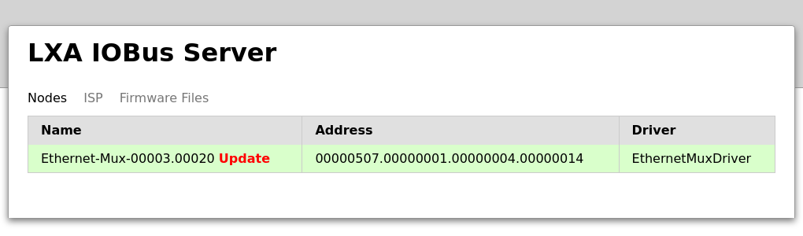
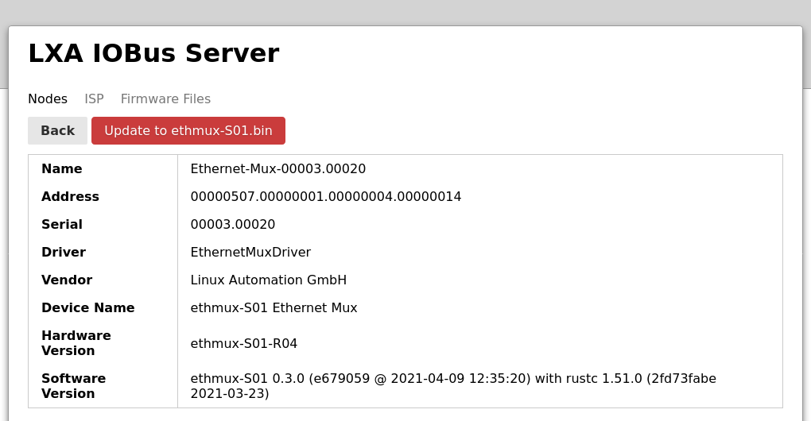
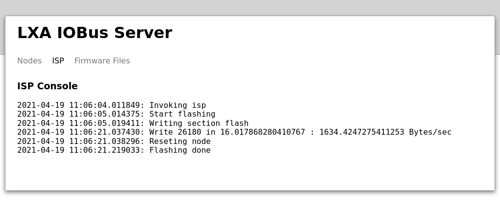

Software and Firmware Upgrades
==============================

Upgrading the lxa-iobus-server
------------------------------

Upgrading the LXA iobus-server is done by installing a new
version of the Python package.

Before installing a new version of the server stop
the currently running lxa-iobus-server.
If you are using the provided systemd-service run:

::

   $ sudo systemctl stop lxa-iobus.service

Afterwards you can build a new ``env``:

::

   $ cd /path/to/the/lxa-iobus/repository
   $ git pull
   $ make clean
   $ make env

Now you can start your service again:

::

   $ sudo systemctl start lxa-iobus.service

Firmware Upgrades
-----------------

.. _firmware-upgrade:

The ``lxa-iobus-server`` software comes bundled with the latest firmware binaries
for the IOBus devices.
The availability of new firmware upgrades for devices
is indicated in the Web-Interface by a red **Update** text in the node list:

   List of nodes. Devices "00003.00020" has a pending firmware upgrade.

A firmware upgrade is performed by selecting the corresponding
entry in the node list
and clicking the *Update to …* button at the top:

   Pressing the "Update to …" button initiates a firmware upgrade.

Clicking the button takes you to the ":term:`ISP`" tab of the
web interface where a log of the flashing progress is shown:

   A successful firmware flashing process terminates with the log message
   "Flashing done".

Once the flashing is compled you can return to the node information
by selecting the "Nodes" tab at the top.
