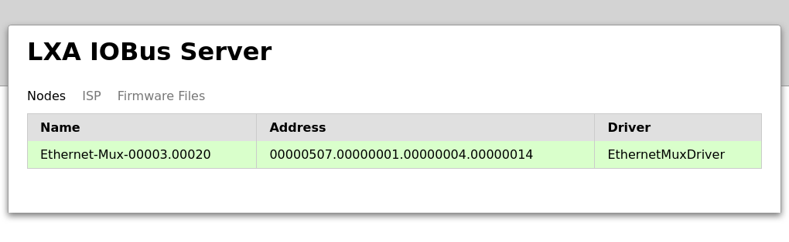
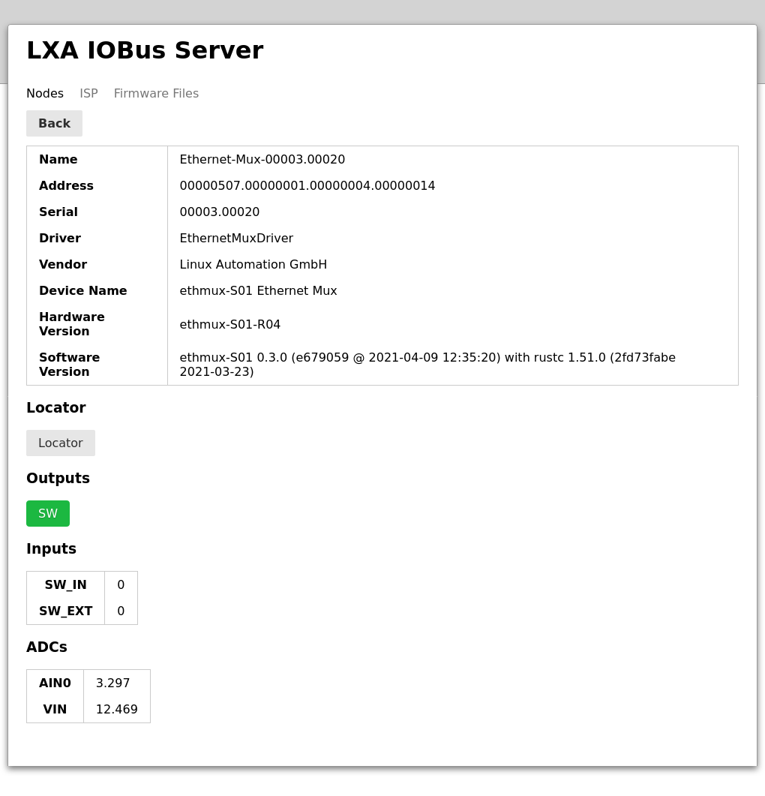
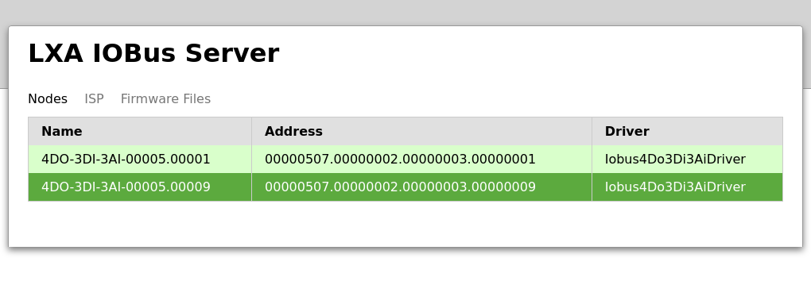

Using the Web-Interface
=======================

.. note:: Make sure you have installed the control software as described in
  :ref:`Getting Started`.

Once started the server should start enumerating devices connected
to the bus.
Visit the IOBus Server web interface at
`http://localhost:8080/ <http://localhost:8080/>`_
for a list of detected IOBus devices:

   List of nodes in the IOBus server web interface

More options to control a particular node are available
by clicking on a line in the list:

   The IOBus server node control interface

Depending on the type of node different inputs and
output are available.
Read the manual for the specific node for more
information on specific options.

The following fields are available for every node:

* **Name:** The logical name for this device.
  This name is used to identify this node on the :term:`REST` interface.
* **Address:** CANopen LSS address for this device.
* **Serial:** Serial number of the device.
* **ADC VIN:** This ADC channel shows the current supply voltage
  on the IOBus.
  This voltage should be between 9 and 13V.
* **Locator:** Toggling the Locator LED, that can be used to find a
  particular device in a lab, is done by clicking the
  *Locator* button in the interface.
  The *Locator* indicator can also be used in the
  opposite direction, as pushing the locator button
  on the Ethernet-Mux also toggles the state
  of the on-board LED and the one shown in the web interface:

   List of nodes. Device "00005.00009" has an active Locator.
